# BSpline 三次B样条曲线

## B样条

$$
P(u)=\sum_{i=0}^n P_i B_{i,k}(u) \quad u\in[u_{k-1},u_{n+1}]
$$

## 四点三次B样条曲线

$$
P(s)=f_1(s)C_1+f_2(s)C_2+f_3(s)C_3+f_4(s)C_4
$$

### 四个样条函数（基函数）

$$
\begin{align}
f_1(s)&=\frac{1}{6}(-s^3+3s^2-3s+1)  \\
f_2(s)&=\frac{1}{6}(3s^3-6s^2+4) \\
f_3(s)&=\frac{1}{6}(-3s^3+3s^2+3s+1) \\
f_4(s)&=\frac{1}{6}s^3
\end{align}
$$

其中：

$s$为归一化路径：$0\leq s\leq 1$

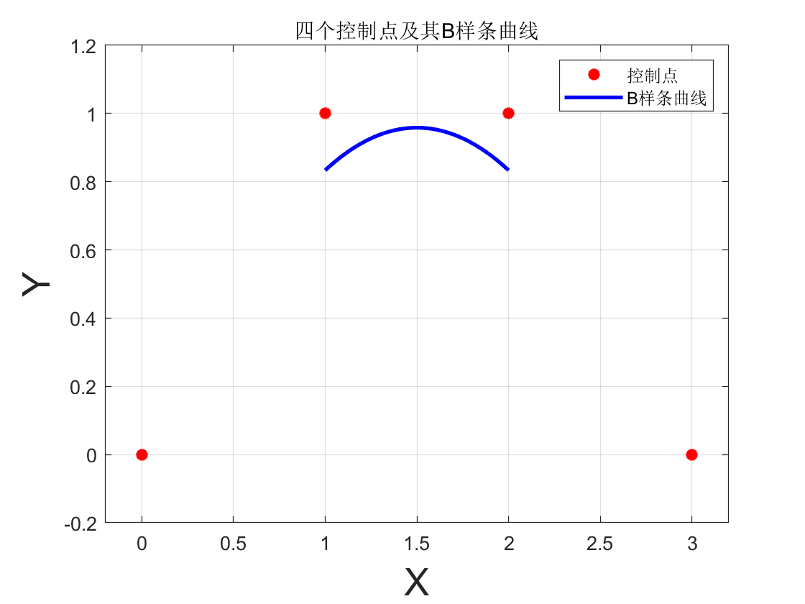

#### 超过四个点？

如果超过了四个点位，我们是否要用更高次幂的函数来拟合？

这样会需要**更复杂的运算**，并且会导致牵一发而动全身的缺点，**无法进行局部调整**

当然，也有这种曲线，就是贝塞尔曲线（Bézier Curves）

##### 贝塞尔曲线

Photoshop中三阶贝塞尔曲线

##### 四点三阶B样条

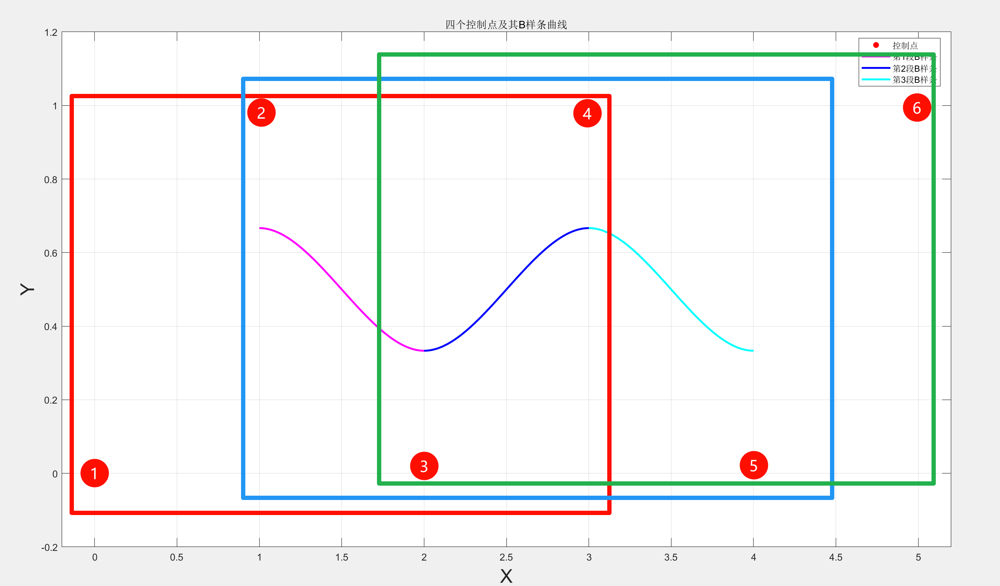

也就是：

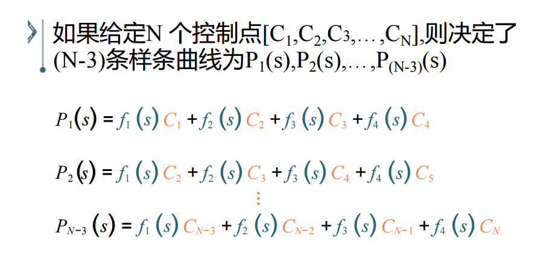

### 过起始点的B样条曲线

上述样条曲线在四点中间，并不过起始点，无法达到我们的拟合或者路径规划的任务

为了能够过起始点，我们采用在起始点添加对称的**增广点**：

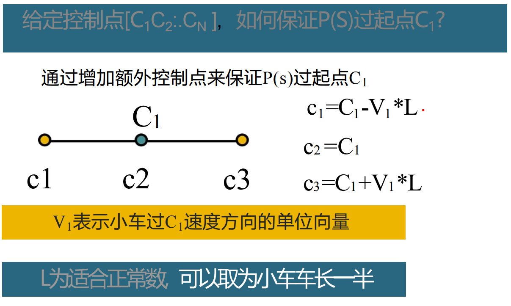

但是采用这种增广模式，如何保证如何保证$P(S)$过起点$C_1$？

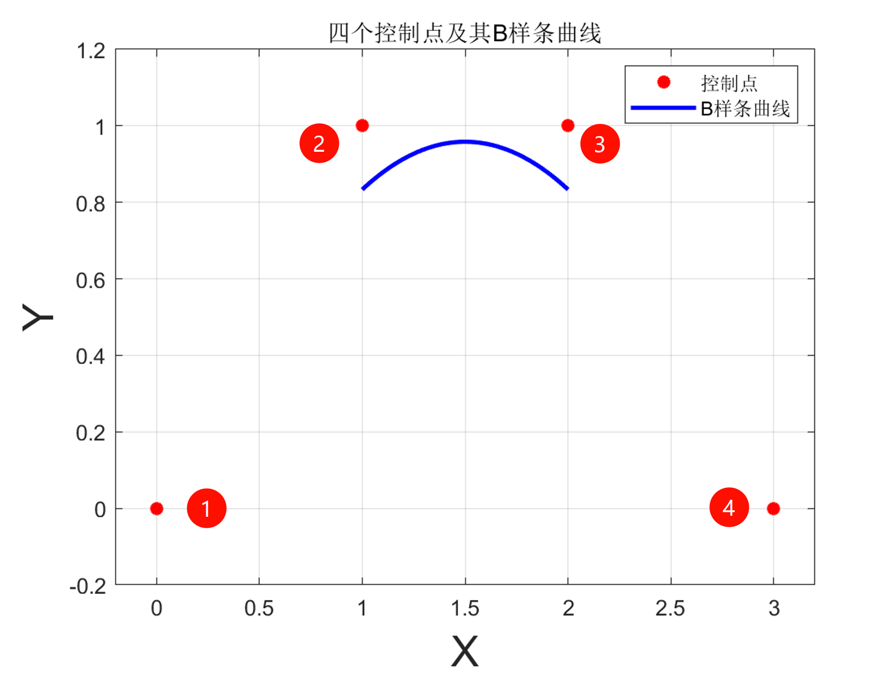

#### 让我们算一算

上式也可以写成矩阵形式：
$$
P(s)=\frac{1}{6} 
\begin{bmatrix}
1  &  s  & s^2 & s^3 \\
\end{bmatrix}

\begin{bmatrix}
 1  &  4  &  1  & 0 \\
 -3  &  0  &  3  & 0 \\
  3  & -6  &  3  & 0 \\
-1  &  3  & -3  & 1 
\end{bmatrix}

\begin{bmatrix}
C_1 \\
C_2 \\
C_3 \\
C_4 \\
\end{bmatrix}
$$
根据矩阵乘法结合率可知：(AB)C=A(BC)
$$
P(s)=\frac{1}{6} 
\begin{bmatrix}
1  &  s  & s^2 & s^3 \\
\end{bmatrix}

\begin{bmatrix}
 C_1+4C_2+C_3 \\
 -3C_1+3C_3   \\
 3C_1-6C_2+3C_3  \\
-C_1+3C_2-3C_3+C_4
\end{bmatrix}
$$

根据起始点增广的形式我们可以得出：
$$
\begin{align}
C_{1}&=C_{O1}-V_1L \\
C_{2}&=C_{O1} \\
C_{3}&=C_{O1}+V_1L
\end{align}
$$
可以看出，这种定义使得原本的$C_1$（或$C_n$）在增广后的**三点连线的中点**，如下图所示

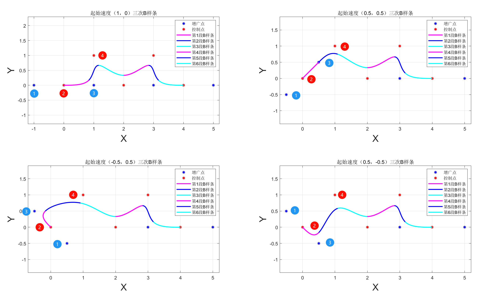

所以为了回答**”给定控制点[$C_1 \ C_2 \ ... \ C_N$]，如何保证$P(S)$过起点$C_1$？”**

我们可以将增广点代入上式，可得：
$$
\begin{align}
P(s)&=\frac{1}{6} 
\begin{bmatrix}
1  &  s  & s^2 & s^3 \\
\end{bmatrix}

\begin{bmatrix}
 C_2+V_1L+4C_2+C_2-V_1L \\
 -3C_2-3V_1L+3C_2-3V_1L   \\
 3C_2+3V_1L-6C_2+3C_2-3V_1L  \\
-C_2-V_1L+3C_2-3C_2+3V_1L+C_4
\end{bmatrix}
\\ 
\\
&=\frac{1}{6} 
\begin{bmatrix}
1  &  s  & s^2 & s^3 \\
\end{bmatrix}

\begin{bmatrix}
 6C_2 \\
 -6V_1L   \\
0  \\
-C_2+C_4+2V_1L
\end{bmatrix}

\\ 
\\
&=
\begin{bmatrix}
1  &  s  & s^2 & s^3 \\
\end{bmatrix}

\begin{bmatrix}
C_2 \\
-V_1L   \\
0  \\
\frac{1}{6}(-C_2+C_4+2V_1L)
\end{bmatrix}

\end{align}
$$
当$s=0$时，即在样条曲线起点：
$$
P(0)=C_2
$$
当我们重新在看这张图片时，就会恍然大悟了

当然，对于终点$C_N$,同理：
$$
\begin{align}
C_{N-2}&=C_{ON}-V_NL \\
C_{N-1}&=C_{ON} \\
C_{N}  &=C_{ON}+V_NL
\end{align}
$$
代入增广矩阵方程：
$$
P(s)=\frac{1}{6} 
\begin{bmatrix}
1  &  s  & s^2 & s^3 \\
\end{bmatrix}

\begin{bmatrix}
 1  &  4  &  1  & 0 \\
 -3  &  0  &  3  & 0 \\
  3  & -6  &  3  & 0 \\
-1  &  3  & -3  & 1 
\end{bmatrix}

\begin{bmatrix}
C_{N-3} \\
C_{N-2} \\
C_{N-1} \\
C_{N} \\
\end{bmatrix}
$$
太懒了，不想手算了 :(

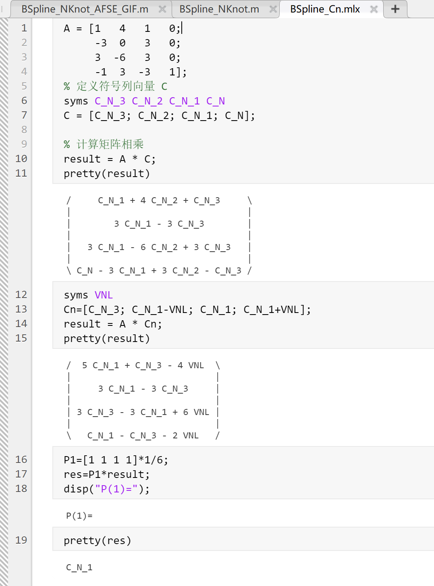

根据MATLAB符号运算工具可知：
$$
P(1)=C_{N-1}
$$
即最后三点的中点，**原始控制点的终点**！

当然如果我们改变增广点的位置，使其不对称，就会出现以下情况：

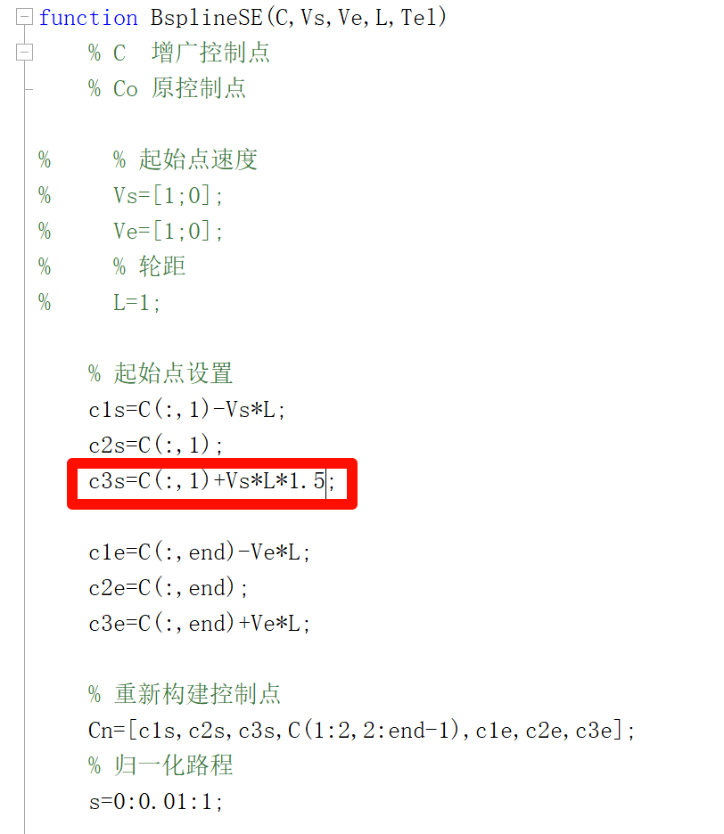

对应图像变化：

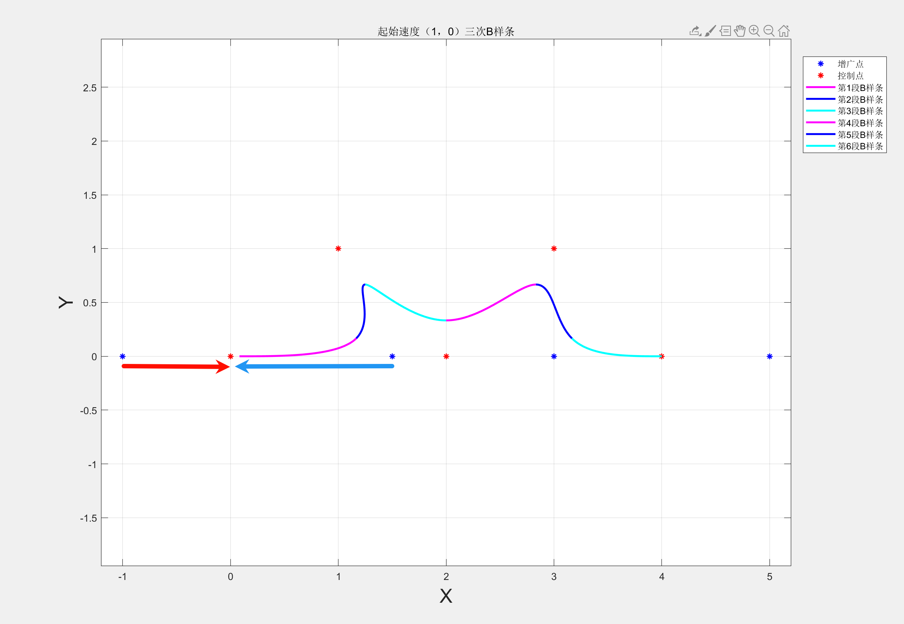

是两点中点吗？

show me your code

当然我们可以通过MATLAB符号运算工具轻松得出任意增广点位的起始点和终点情况：

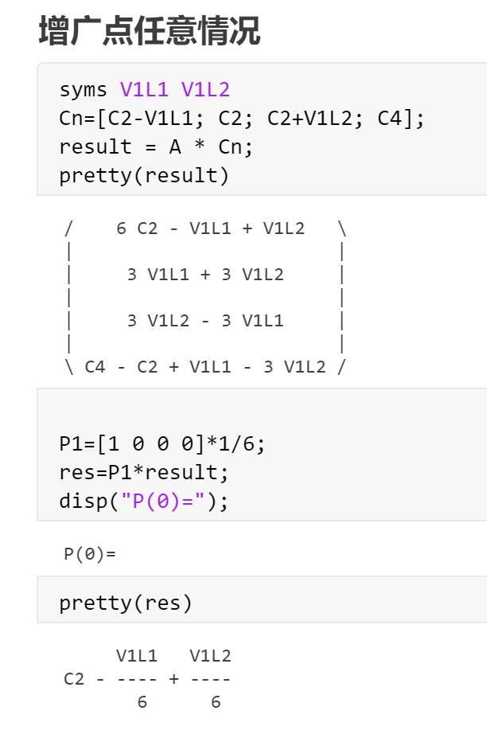

即：
$$
P(0)=C_2-\frac{V_{11}L}{6}+\frac{V_{12}L}{6} \\
P(1)=C_{N-1}-\frac{V_{N1}L}{6}+\frac{V_{N2}L}{6} \\
$$

## 三次B样条在起始点速度对样条的影响

### 从应用角度：

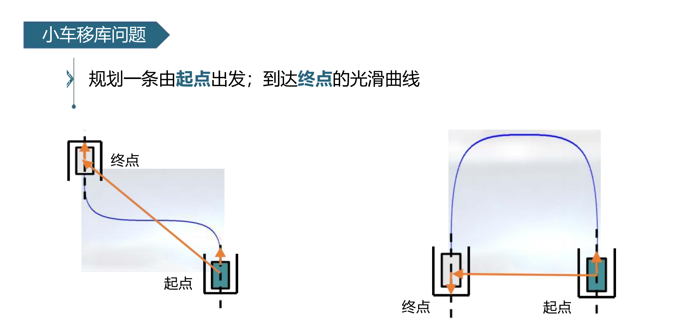

针对第二个入库问题，下列哪个是最合适的解法：

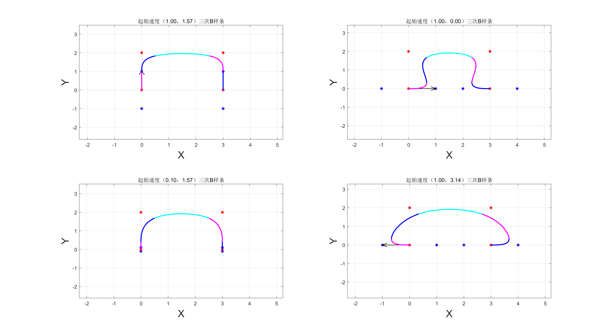

所以，起始点的速度$V$不同（方向和大小），最后生成的B样条也不同，最终方向取决于实际需求

# Source Code

